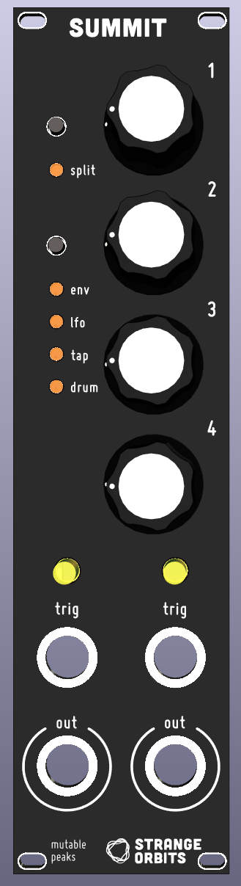

# Summit is a KOSMO adaption of [Matias Levy's bluepill version](https://github.com/matias-levy/peaks) of [Mutable instrument's Peaks](https://mutable-instruments.net/modules/peaks/)

> **Warning**
> You need the 128k flash version of the bluepill board which might be difficult to obtain. I was lucky with [this](https://www.amazon.com/Teyleten-Robot-Development-STM32F103C8T6-Learning/dp/B08THXZ6XK) item, someone on the LMNC forum was able to get a 128k [here on aliexpress](https://www.aliexpress.us/item/3256801435312142.html?spm=a2g0o.order_list.0.0.4e301802nbwQXK&gatewayAdapt=glo2usa&_randl_shipto=US), but there is no guarantee!

## Firmwares
There's the option to flash one of two firmwares that where ported. The original Mutable Instruments one is in the firmware/peaks directory. The [Mutated Mutables Dead Man's Catch](https://github.com/timchurches/Mutated-Mutables/tree/master/peaks) is in the firmware/peaks2. The later adds a lot of functionality to the module, although the UI becomes a bit confusing.  
Compiled binaries and HEX files are provided for both under firmware/build.

## Changes
* Added a driver for the PWM DAC running at **14 bit depth, 48Khz sampling rate.** (File in firmware/peaks/drivers/pwm_dac.h)
* Activated the clock for the TIM4 in firmware/peaks/drivers/system.cc
* **Bypassed the bootloader:** This was done as to simplify the code, it does not interfere with the calibration functionality of the module.
* Redesigned the output portion of the hardware to accommodate to the PWM levels.

## Flashing and development
To make it easier I have left binaries and .HEX files in firmware/build, this can be flashed directly to the bluepill using [STM32CubeProgrammer](https://www.st.com/en/development-tools/stm32cubeprog.html).  
Another option is to install the [mutable-dev-environment](https://github.com/pichenettes/mutable-dev-environment) and replace the peaks folder with the one inside /firmware, then executing

    make -f peaks/makefile upload_serial

We use this command because the bootloader is bypassed.

## Thanks
I want to thank Emilie Gillet for open-sourcing her work which is a constant inspiration for many musicians and makers, and encourage everyone interested in this project to checkout the [Mutable instrument's Forum](https://forum.mutable-instruments.net/) in which Emilie is a very active member.
